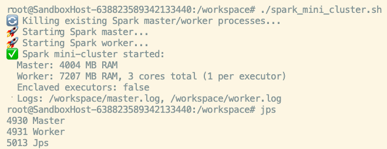
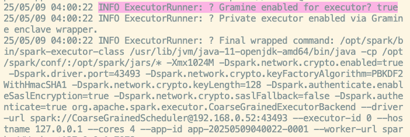
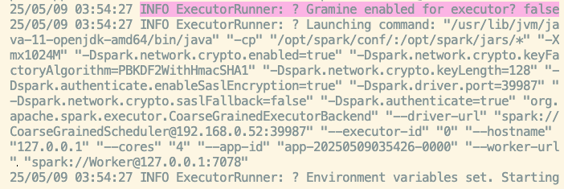
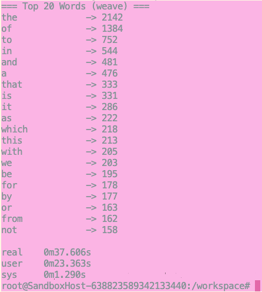
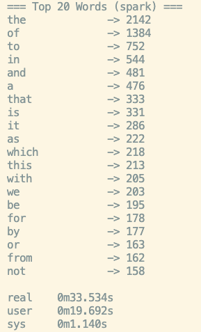
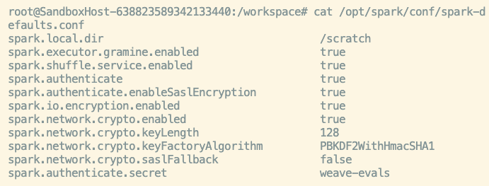

## 🧵🌀🧶
## 🔁 Reproducible Execution of Spark Workloads with Weave Shuffle

This repository provides a unified interface for executing Spark workloads using the **Weave custom shuffle manager**, orchestrated through the **Spool framework**. The workflow supports deterministic dataset scaling, Spark job submission, enclave context isolation, and profiling—ensuring a reproducible, containerized evaluation environment suitable for both development and artifact evaluation.

---

# 📦 Weave + Spool: Getting Started

Weave is a secure shuffle engine for Apache Spark that integrates with SGX enclaves using Gramine. This repository packages three independent Weave components and a patched version of Spark, all inside a single Docker-based environment.

Spool orchestrates context creation and transparent enclave management for Weave.

--


## 🧰 Prerequisites

- An x86_64 machine (⚠️ ARM is not supported due to Gramine's ISA requirements)
- Docker installed
- Ubuntu 20.04+ or compatible
- At least 8GB RAM recommended

---

## 🚀 Quick Start

## 🐳 Docker Image

We provide a prebuilt Docker image to simplify running Weave and Spool:

```bash
docker pull solei/spark-spool-direct
```


## Running the HelloWorld Examples in Weave

This guide explains how to run the `HelloWorld` examples under different execution modes, including native Spark, Weave, and Gramine-SGX. The goal is to demonstrate the behavior and overheads of our secure shuffle mechanism (Weave) in both associative and non-associative workloads.

---

### Prerequisites

* You must be inside the Docker container built from our artifact.
* Ensure at least 8GB of memory is available. For low-memory setups, reduce the data size as shown below.

---

### Step 1: Launch the Mini Cluster

To enable enclave-based execution with Gramine, first run:

```bash
./spark_mini_cluster.sh
```

This script launches a Spark master and two workers inside Gramine-SGX enclaves. The script may be fragile, so **verify the processes** are running using:

```bash
jps
```

You should see entries for `Master` and two `Worker` processes.

**Illustration:**

* Mini cluster launch: 



---

### Step 2: Compile the Manifest and Warm Up the Executor Class

* To reduce startup overhead and ensure the enclave is properly initialized, we recommend running the SparkPi example after launching the cluster and **before** testing Weave functionality:

```bash
/opt/spark/bin/spark-submit \
  --class org.apache.spark.examples.SparkPi \
  --master spark://127.0.0.1:7077 \
  /opt/spark/jars/spark-examples_2.12-3.2.2.jar \
  100
```

This script computes an estimate of Pi using 100 splits. A successful run confirms that Weave has correctly launched Gramine-based executors and the environment is ready for Weave functionality tests.

---- 


### Step 3: Run the HelloWorld Examples

Once the cluster is running, execute the HelloWorld WordCount and Sort examples:

```bash
./helloworld/HelloWorldContainerWordCount.sh
./helloworld/HelloWorldContainerSort.sh
```

These scripts run:

* **Spark (vanilla)**
* **ColumnSort** (based on Opaque core)
* **Weave** (our secure shuffle)

> SnB is skipped due to memory constraints in container setups.

---

### Step 4: Example Outputs and Visual Comparison

You can inspect /workspace/Worker.log to see that Weave is using Gramine for running the executors under the hood. Example output:

* **Enclave-based Spark Worker Log**:

 

If you wish, you can turn the enclave execution off in 
  ```
  /opt/spark/conf/spark-defaults.conf
  ```
Run the Spark mini cluster again, and then the same SparkPI example, to see how Weave works without Gramine. Then the worker logs will look like the snippet below. 

* **Non-enclave Spark Worker Log**:

 


#### WordCount Results

Weave vs Spark (Associative Task):

 

In our run, for associative operations like WordCount, Weave incurs **only \~12% overhead**, thanks to sampling and tight-packing optimizations.

#### Sort Results

However, for non-associative operations like sorting, the overhead can be significantly higher.

> Weave can experience up to **150% overhead** for tasks like Sort, where Spark applies aggressive optimizations while Weave must insert fake records and perform full reshuffling.

---

### Notes

* Gramine and encryption settings are managed via:

  ```
  /opt/spark/conf/spark-defaults.conf
  ```

 


* Weave executors are launched via:

  ```
  /opt/spark/bin/spark-executor-class
  ```

  This script checks memory settings and rebuilds Gramine manifests if needed. As a result, the first `spark-submit` invocation is slower due to manifest compilation.


---

### Troubleshooting

* If logs or outputs are missing, rerun `spark_mini_cluster.sh` and confirm `jps` shows the correct processes.
* Use fewer records (e.g., 1 million instead of 2 million) for Sort if memory is limited.

---

**End of kick tires HelloWorld examples readme. Our artifact is fully functional if it has passed the Hello World test.**

For more details about:
- Result reproduction: refer to the [reproduction readme](https://github.com/MattSlm/weave-artifacts/blob/main/experiments/ReprodcutionReadme.md). 
- Weave design: refer to our repo for [Weave development] (https://github.com/MattSlm/spark-weave-shuffle/tree/main). _This repo is not used at any stage for artifact evaluation_

Continue reading to troubleshoot the artifact if the tests above have failed. 
 
## 🧪 Manual Verification (Recommended)

### ✅ Step 1: Start Spark Master (unenclaved)

```bash
/opt/spark/bin/spark-class \
  org.apache.spark.deploy.master.Master \
  --host 127.0.0.1 \
  --port 7077 \
  --webui-port 8080
```

> Note: Master is intentionally unenclaved. Weave assumes job metadata is not sensitive.

---

### ✅ Step 2: Start Spark Worker

```bash
/opt/spark/bin/spark-class \
  org.apache.spark.deploy.worker.Worker \
  spark://127.0.0.1:7077 \
  --host 127.0.0.1 \
  --webui-port 8081 \
  --cores 2 \
  --memory 4g
```

Adjust `--memory` as needed for your system.

---

### ✅ Step 3: Submit SparkPi job

```bash
/opt/spark/bin/spark-submit \
  --class org.apache.spark.examples.SparkPi \
  --master spark://127.0.0.1:7077 \
  /opt/spark/examples/jars/spark-examples_2.12-3.2.2.jar \
  100
```

✨ This job triggers Weave to:
- Compile a Gramine manifest
- Create a secure context
- Launch encrypted executors

---

## 🔐 Encryption and Executor Contexts

- Spark encryption settings are defined in `/opt/spark/conf/spark-defaults.conf`
- Weave adds encryption at the executor layer via SGX enclaves
- Spool manages:
  - Global worker context: `/opt/spark/enclave`
  - Per-executor context: `/opt/spark/work/<app-id>/<executor-id>`

---

## 🛠 Dependency Recovery

If you encounter errors like:

```
NoClassDefFoundError: scala/PartialFunction
NoClassDefFoundError: org/apache/log4j/spi/Filter
```

Run this to restore build-time JARs:

```bash
cp /opt/private-repos/weave-artifacts-auto/docker/spool/scripts/*.sh /opt/
cd /opt
./parse-system-deps.sh
./install-deps-from-lock.sh
```

If jars are still missing, use:
```bash
/workspace/patch-jars.sh
```

This script recursively finds all missing `.jar` files and copies them into `/opt/spark/jars`.

---

## 🔁 Weave Shuffle Tests

These tests run synthetic 1M-record workloads to benchmark various shuffle strategies:

### ➤ Associative Shuffle

```bash
spark-submit \
  --class org.apache.spark.shuffle.weave.WeaveShufflePerfAssoTest \
  ~/weave-serial/target/scala-2.12/spark-weave-shuffle_2.12-0.1.0.jar
```

> ⏱️ Output: *200 keys shuffled in ~1.4s*

---

### ➤ Non-Associative Shuffle (Sorting)

```bash
spark-submit \
  --class org.apache.spark.shuffle.weave.WeaveShufflePerfTest \
  ~/weave-serial/target/scala-2.12/spark-weave-shuffle_2.12-0.1.0.jar
```

> ⏱️ Output: *~3M records shuffled in ~2.0s*

---

### ➤ Column Sort Benchmark

```bash
spark-submit \
  --class org.apache.spark.shuffle.baseline.TestColumnSort \
  ~/weave-serial/target/scala-2.12/spark-weave-shuffle_2.12-0.1.0.jar
```

> ⏱️ Output: *1M sorted records in ~9.2s*

---

## 📘 Upcoming Integration Tests

- 🔠 Word Count on Project Gutenberg books
- 📧 Enron Email Dataset secure shuffle
- 📊 MelbourneShuffle & ColumnJoin benchmarks

---

## 📎 Notes

- All Spark workers are plaintext-aware; only executors run in SGX.
- Weave automates manifest generation, enclave compilation, and launch.
- `spark.executor.gramine.enabled=true` triggers encrypted execution.


---


